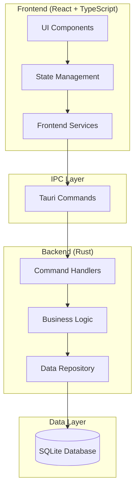
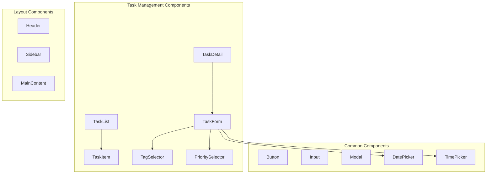

# Design Document

## Overview

核心任务管理功能的设计基于现代化的前后端分离架构，使用 React + TypeScript 作为前端，Rust + Tauri 作为后端，SQLite 作为本地数据存储。设计遵循组件化、模块化的原则，确保代码的可维护性和可扩展性。

系统采用命令模式处理前后端通信，通过 Tauri 的 IPC 机制实现安全的跨进程调用。数据层使用 Repository 模式抽象数据访问，业务逻辑层提供清晰的服务接口，前端使用状态管理库统一管理应用状态。

## Architecture

### System Architecture



### Component Architecture



## Components and Interfaces

### Frontend Components

#### TaskList Component
```typescript
interface TaskListProps {
  tasks: Task[];
  onTaskSelect: (task: Task) => void;
  onTaskToggle: (taskId: string) => void;
  onTaskDelete: (taskId: string) => void;
  filter?: TaskFilter;
  sortBy?: TaskSortOption;
}
```

#### TaskItem Component
```typescript
interface TaskItemProps {
  task: Task;
  level?: number; // For subtask indentation
  onToggle: (taskId: string) => void;
  onEdit: (task: Task) => void;
  onDelete: (taskId: string) => void;
  onAddSubtask: (parentId: string) => void;
}
```

#### TaskForm Component
```typescript
interface TaskFormProps {
  task?: Task; // undefined for new task
  onSave: (task: TaskInput) => void;
  onCancel: () => void;
  parentTaskId?: string; // For subtasks
}
```

#### TagSelector Component
```typescript
interface TagSelectorProps {
  selectedTags: string[];
  availableTags: Tag[];
  onTagsChange: (tags: string[]) => void;
  onCreateTag: (tagName: string) => void;
}
```

### Backend Interfaces

#### Task Service
```rust
pub trait TaskService {
    async fn create_task(&self, input: CreateTaskInput) -> Result<Task, TaskError>;
    async fn get_task(&self, id: &str) -> Result<Option<Task>, TaskError>;
    async fn list_tasks(&self, filter: TaskFilter) -> Result<Vec<Task>, TaskError>;
    async fn update_task(&self, id: &str, input: UpdateTaskInput) -> Result<Task, TaskError>;
    async fn delete_task(&self, id: &str) -> Result<(), TaskError>;
    async fn toggle_task_status(&self, id: &str) -> Result<Task, TaskError>;
    async fn add_subtask(&self, parent_id: &str, input: CreateTaskInput) -> Result<Task, TaskError>;
}
```

#### Tag Service
```rust
pub trait TagService {
    async fn create_tag(&self, name: &str, color: Option<&str>) -> Result<Tag, TagError>;
    async fn list_tags(&self) -> Result<Vec<Tag>, TagError>;
    async fn delete_unused_tags(&self) -> Result<Vec<String>, TagError>;
    async fn get_tasks_by_tag(&self, tag_name: &str) -> Result<Vec<Task>, TagError>;
}
```

#### Audit Service
```rust
pub trait AuditService {
    async fn log_task_created(&self, task: &Task) -> Result<(), AuditError>;
    async fn log_task_updated(&self, old_task: &Task, new_task: &Task) -> Result<(), AuditError>;
    async fn log_task_deleted(&self, task: &Task) -> Result<(), AuditError>;
    async fn get_task_history(&self, task_id: &str) -> Result<Vec<AuditLog>, AuditError>;
}
```

## Data Models

### Core Task Model
```typescript
interface Task {
  id: string;
  title: string;
  description?: string;
  status: TaskStatus;
  priority: TaskPriority;
  dueDate?: Date;
  estimatedDuration?: number; // in minutes
  startTime?: Date;
  completedAt?: Date;
  createdAt: Date;
  updatedAt: Date;
  parentId?: string;
  tags: string[];
  progress?: number; // 0-100, calculated from subtasks
}

enum TaskStatus {
  TODO = 'todo',
  IN_PROGRESS = 'in_progress',
  COMPLETED = 'completed'
}

enum TaskPriority {
  NONE = 'none',
  LOW = 'low',
  MEDIUM = 'medium',
  HIGH = 'high'
}
```

### Tag Model
```typescript
interface Tag {
  id: string;
  name: string;
  color: string;
  createdAt: Date;
  usageCount: number;
}
```

### Audit Log Model
```typescript
interface AuditLog {
  id: string;
  taskId: string;
  action: AuditAction;
  oldValue?: any;
  newValue?: any;
  fieldName?: string;
  timestamp: Date;
}

enum AuditAction {
  CREATED = 'created',
  UPDATED = 'updated',
  STATUS_CHANGED = 'status_changed',
  DELETED = 'deleted'
}
```

### Database Schema

#### Tasks Table
```sql
CREATE TABLE tasks (
    id TEXT PRIMARY KEY,
    title TEXT NOT NULL,
    description TEXT,
    status TEXT NOT NULL DEFAULT 'todo',
    priority TEXT NOT NULL DEFAULT 'none',
    due_date INTEGER, -- Unix timestamp
    estimated_duration INTEGER, -- in minutes
    start_time INTEGER, -- Unix timestamp
    completed_at INTEGER, -- Unix timestamp
    created_at INTEGER NOT NULL,
    updated_at INTEGER NOT NULL,
    parent_id TEXT,
    FOREIGN KEY (parent_id) REFERENCES tasks(id) ON DELETE CASCADE
);
```

#### Tags Table
```sql
CREATE TABLE tags (
    id TEXT PRIMARY KEY,
    name TEXT UNIQUE NOT NULL,
    color TEXT NOT NULL,
    created_at INTEGER NOT NULL
);
```

#### Task Tags Junction Table
```sql
CREATE TABLE task_tags (
    task_id TEXT NOT NULL,
    tag_id TEXT NOT NULL,
    PRIMARY KEY (task_id, tag_id),
    FOREIGN KEY (task_id) REFERENCES tasks(id) ON DELETE CASCADE,
    FOREIGN KEY (tag_id) REFERENCES tags(id) ON DELETE CASCADE
);
```

#### Audit Logs Table
```sql
CREATE TABLE audit_logs (
    id TEXT PRIMARY KEY,
    task_id TEXT NOT NULL,
    action TEXT NOT NULL,
    old_value TEXT, -- JSON
    new_value TEXT, -- JSON
    field_name TEXT,
    timestamp INTEGER NOT NULL,
    FOREIGN KEY (task_id) REFERENCES tasks(id) ON DELETE CASCADE
);
```

## Error Handling

### Frontend Error Handling
```typescript
interface TaskError {
  code: string;
  message: string;
  details?: any;
}

class TaskErrorHandler {
  static handle(error: TaskError): void {
    switch (error.code) {
      case 'TASK_NOT_FOUND':
        showNotification('任务不存在', 'error');
        break;
      case 'VALIDATION_ERROR':
        showValidationErrors(error.details);
        break;
      case 'DATABASE_ERROR':
        showNotification('数据库操作失败，请重试', 'error');
        break;
      default:
        showNotification('操作失败，请重试', 'error');
    }
  }
}
```

### Backend Error Handling
```rust
#[derive(Debug, thiserror::Error)]
pub enum TaskError {
    #[error("Task not found: {id}")]
    NotFound { id: String },
    
    #[error("Validation error: {message}")]
    Validation { message: String },
    
    #[error("Database error: {source}")]
    Database { source: sqlx::Error },
    
    #[error("Circular dependency detected in subtasks")]
    CircularDependency,
    
    #[error("Maximum subtask depth exceeded")]
    MaxDepthExceeded,
}
```

## Testing Strategy

### Unit Testing

#### Frontend Testing
- **Component Testing**: 使用 React Testing Library 测试组件渲染和交互
- **Hook Testing**: 测试自定义 hooks 的状态管理逻辑
- **Service Testing**: 模拟 Tauri 命令测试前端服务层
- **Utility Testing**: 测试日期处理、格式化等工具函数

#### Backend Testing
- **Service Testing**: 测试业务逻辑服务的各种场景
- **Repository Testing**: 使用内存数据库测试数据访问层
- **Command Testing**: 测试 Tauri 命令处理器
- **Model Testing**: 测试数据模型的序列化和验证

### Integration Testing

#### End-to-End Testing
- **Task CRUD Operations**: 完整的任务创建、读取、更新、删除流程
- **Subtask Management**: 父子任务关系和状态联动
- **Tag Operations**: 标签创建、关联、筛选功能
- **Audit Logging**: 变更历史记录的完整性

#### Performance Testing
- **Large Dataset**: 测试10,000+任务的性能表现
- **Memory Usage**: 监控内存使用情况
- **Response Time**: 确保操作响应时间<200ms
- **Database Optimization**: 测试索引和查询优化效果

### Test Data Management
```typescript
// Test fixtures for consistent testing
export const mockTasks: Task[] = [
  {
    id: 'task-1',
    title: 'Complete project documentation',
    status: TaskStatus.TODO,
    priority: TaskPriority.HIGH,
    dueDate: new Date('2024-12-31'),
    tags: ['work', 'documentation'],
    createdAt: new Date('2024-01-01'),
    updatedAt: new Date('2024-01-01')
  },
  // More test data...
];
```

## Performance Considerations

### Frontend Optimization
- **Virtual Scrolling**: 对于大量任务列表使用虚拟滚动
- **Memoization**: 使用 React.memo 和 useMemo 优化重渲染
- **Lazy Loading**: 按需加载任务详情和历史记录
- **Debounced Search**: 搜索和筛选操作使用防抖

### Backend Optimization
- **Database Indexing**: 为常用查询字段创建索引
- **Connection Pooling**: 使用连接池管理数据库连接
- **Batch Operations**: 批量处理多个任务操作
- **Caching**: 缓存频繁访问的标签和配置数据

### Database Indexes
```sql
-- Performance indexes
CREATE INDEX idx_tasks_status ON tasks(status);
CREATE INDEX idx_tasks_due_date ON tasks(due_date);
CREATE INDEX idx_tasks_parent_id ON tasks(parent_id);
CREATE INDEX idx_tasks_created_at ON tasks(created_at);
CREATE INDEX idx_task_tags_task_id ON task_tags(task_id);
CREATE INDEX idx_task_tags_tag_id ON task_tags(tag_id);
CREATE INDEX idx_audit_logs_task_id ON audit_logs(task_id);
```

## Security Considerations

### Data Validation
- **Input Sanitization**: 所有用户输入都需要验证和清理
- **SQL Injection Prevention**: 使用参数化查询
- **XSS Prevention**: 前端输出转义
- **File Path Validation**: 防止路径遍历攻击

### Access Control
- **Local Data Only**: 数据仅存储在本地，无网络传输
- **File Permissions**: 确保数据库文件权限正确设置
- **Process Isolation**: Tauri 提供的进程隔离保护

### Audit Trail
- **Complete Logging**: 记录所有数据变更操作
- **Tamper Detection**: 检测审计日志的完整性
- **Data Retention**: 定义日志保留策略