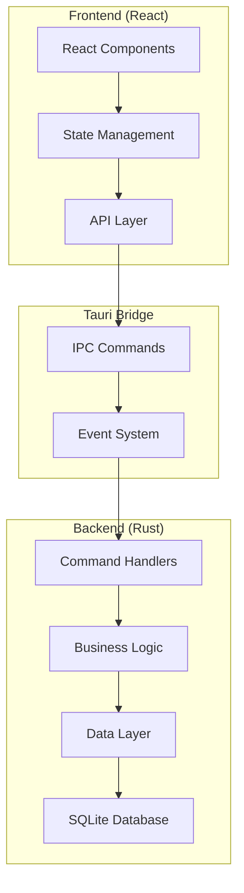

# 设计文档

## 概述

uletodo 是一个基于 React + Tauri + Rust 技术栈的跨平台待办事项管理应用。应用采用现代化的架构设计，前端使用 React 构建用户界面，后端使用 Rust 处理数据存储和业务逻辑，通过 Tauri 框架实现跨平台桌面应用的打包和分发。

## 架构

### 整体架构



### 技术栈选择

- **前端**: React 18 + TypeScript + Vite
- **状态管理**: Zustand (轻量级状态管理)
- **UI 组件库**: Tailwind CSS + Headless UI
- **后端**: Rust + Tauri
- **数据库**: SQLite (通过 rusqlite)
- **构建工具**: Vite + Tauri CLI

## 组件和接口

### 前端组件架构

```
src/
├── components/
│   ├── layout/
│   │   ├── Sidebar.tsx          # 侧边栏导航
│   │   ├── Header.tsx           # 顶部标题栏
│   │   └── MainLayout.tsx       # 主布局容器
│   ├── task/
│   │   ├── TaskList.tsx         # 任务列表
│   │   ├── TaskItem.tsx         # 单个任务项
│   │   ├── TaskForm.tsx         # 任务创建/编辑表单
│   │   └── TaskDetail.tsx       # 任务详情面板
│   ├── project/
│   │   ├── ProjectList.tsx      # 项目列表
│   │   ├── ProjectItem.tsx      # 项目项
│   │   └── ProjectForm.tsx      # 项目创建表单
│   └── common/
│       ├── Button.tsx           # 通用按钮组件
│       ├── Input.tsx            # 输入框组件
│       ├── Modal.tsx            # 模态框组件
│       └── DatePicker.tsx       # 日期选择器
├── stores/
│   ├── taskStore.ts             # 任务状态管理
│   ├── projectStore.ts          # 项目状态管理
│   └── uiStore.ts               # UI 状态管理
├── services/
│   ├── taskService.ts           # 任务相关 API 调用
│   ├── projectService.ts        # 项目相关 API 调用
│   └── tauriApi.ts              # Tauri IPC 封装
├── types/
│   ├── task.ts                  # 任务类型定义
│   ├── project.ts               # 项目类型定义
│   └── common.ts                # 通用类型定义
└── utils/
    ├── dateUtils.ts             # 日期处理工具
    ├── validation.ts            # 数据验证
    └── constants.ts             # 常量定义
```

### 后端模块架构

```
src-tauri/src/
├── commands/
│   ├── task_commands.rs         # 任务相关命令
│   ├── project_commands.rs      # 项目相关命令
│   └── mod.rs
├── models/
│   ├── task.rs                  # 任务数据模型
│   ├── project.rs               # 项目数据模型
│   └── mod.rs
├── database/
│   ├── connection.rs            # 数据库连接管理
│   ├── migrations.rs            # 数据库迁移
│   ├── task_repository.rs       # 任务数据访问层
│   ├── project_repository.rs    # 项目数据访问层
│   └── mod.rs
├── services/
│   ├── task_service.rs          # 任务业务逻辑
│   ├── project_service.rs       # 项目业务逻辑
│   └── mod.rs
├── utils/
│   ├── error.rs                 # 错误处理
│   ├── config.rs                # 配置管理
│   └── mod.rs
└── main.rs                      # 应用入口
```

### IPC 接口定义

#### 任务相关命令

```rust
// Task Commands
#[tauri::command]
async fn create_task(task: CreateTaskRequest) -> Result<Task, String>

#[tauri::command]
async fn get_tasks(project_id: Option<i32>) -> Result<Vec<Task>, String>

#[tauri::command]
async fn update_task(id: i32, task: UpdateTaskRequest) -> Result<Task, String>

#[tauri::command]
async fn delete_task(id: i32) -> Result<(), String>

#[tauri::command]
async fn toggle_task_status(id: i32) -> Result<Task, String>
```

#### 项目相关命令

```rust
// Project Commands
#[tauri::command]
async fn create_project(project: CreateProjectRequest) -> Result<Project, String>

#[tauri::command]
async fn get_projects() -> Result<Vec<Project>, String>

#[tauri::command]
async fn update_project(id: i32, project: UpdateProjectRequest) -> Result<Project, String>

#[tauri::command]
async fn delete_project(id: i32) -> Result<(), String>

#[tauri::command]
async fn get_project_stats(id: i32) -> Result<ProjectStats, String>
```

## 数据模型

### 数据库设计

```sql
-- Projects table
CREATE TABLE projects (
    id INTEGER PRIMARY KEY AUTOINCREMENT,
    name TEXT NOT NULL,
    description TEXT,
    color TEXT DEFAULT '#3B82F6',
    created_at DATETIME DEFAULT CURRENT_TIMESTAMP,
    updated_at DATETIME DEFAULT CURRENT_TIMESTAMP
);

-- Tasks table
CREATE TABLE tasks (
    id INTEGER PRIMARY KEY AUTOINCREMENT,
    title TEXT NOT NULL,
    description TEXT,
    completed BOOLEAN DEFAULT FALSE,
    priority INTEGER DEFAULT 1, -- 1: Low, 2: Medium, 3: High
    due_date DATETIME,
    project_id INTEGER,
    created_at DATETIME DEFAULT CURRENT_TIMESTAMP,
    updated_at DATETIME DEFAULT CURRENT_TIMESTAMP,
    FOREIGN KEY (project_id) REFERENCES projects (id) ON DELETE CASCADE
);

-- Indexes for performance
CREATE INDEX idx_tasks_project_id ON tasks(project_id);
CREATE INDEX idx_tasks_completed ON tasks(completed);
CREATE INDEX idx_tasks_due_date ON tasks(due_date);
```

### TypeScript 类型定义

```typescript
// Task types
interface Task {
  id: number;
  title: string;
  description?: string;
  completed: boolean;
  priority: Priority;
  dueDate?: string;
  projectId?: number;
  createdAt: string;
  updatedAt: string;
}

interface CreateTaskRequest {
  title: string;
  description?: string;
  priority?: Priority;
  dueDate?: string;
  projectId?: number;
}

interface UpdateTaskRequest {
  title?: string;
  description?: string;
  priority?: Priority;
  dueDate?: string;
  projectId?: number;
}

// Project types
interface Project {
  id: number;
  name: string;
  description?: string;
  color: string;
  createdAt: string;
  updatedAt: string;
}

interface ProjectStats {
  totalTasks: number;
  completedTasks: number;
  pendingTasks: number;
}

// Common types
enum Priority {
  Low = 1,
  Medium = 2,
  High = 3,
}
```

## 错误处理

### 错误类型定义

```rust
#[derive(Debug, thiserror::Error)]
pub enum AppError {
    #[error("Database error: {0}")]
    Database(#[from] rusqlite::Error),
    
    #[error("Validation error: {0}")]
    Validation(String),
    
    #[error("Not found: {0}")]
    NotFound(String),
    
    #[error("Internal error: {0}")]
    Internal(String),
}

impl From<AppError> for String {
    fn from(error: AppError) -> Self {
        error.to_string()
    }
}
```

### 前端错误处理策略

- 使用 React Error Boundaries 捕获组件错误
- 实现全局错误状态管理
- 提供用户友好的错误提示
- 记录错误日志用于调试

## 测试策略

### 前端测试

- **单元测试**: 使用 Vitest + React Testing Library
  - 组件渲染测试
  - 用户交互测试
  - 状态管理测试
  
- **集成测试**: 
  - API 服务层测试
  - 端到端用户流程测试

### 后端测试

- **单元测试**: 使用 Rust 内置测试框架
  - 数据模型测试
  - 业务逻辑测试
  - 数据库操作测试
  
- **集成测试**:
  - Tauri 命令测试
  - 数据库迁移测试

### 测试数据管理

- 使用内存数据库进行测试
- 实现测试数据工厂
- 每个测试用例独立的数据环境

## 性能优化

### 前端优化

- React.memo 优化组件重渲染
- 虚拟滚动处理大量任务列表
- 懒加载非关键组件
- 状态更新防抖处理

### 后端优化

- 数据库查询优化和索引
- 连接池管理
- 批量操作支持
- 缓存常用查询结果

### 应用启动优化

- 延迟加载非核心功能
- 预加载关键数据
- 优化 Tauri 窗口创建时间

## 安全考虑

### 数据安全

- 输入验证和清理
- SQL 注入防护
- XSS 攻击防护

### 应用安全

- Tauri 安全配置
- 最小权限原则
- 安全的 IPC 通信

## 部署和分发

### 构建配置

- 开发环境: 热重载和调试工具
- 生产环境: 代码压缩和优化
- 多平台构建脚本

### 应用打包

- Windows: MSI 安装包
- macOS: DMG 磁盘映像
- Linux: AppImage 和 DEB 包

### 自动更新

- 集成 Tauri 更新机制
- 版本检查和下载
- 静默更新选项